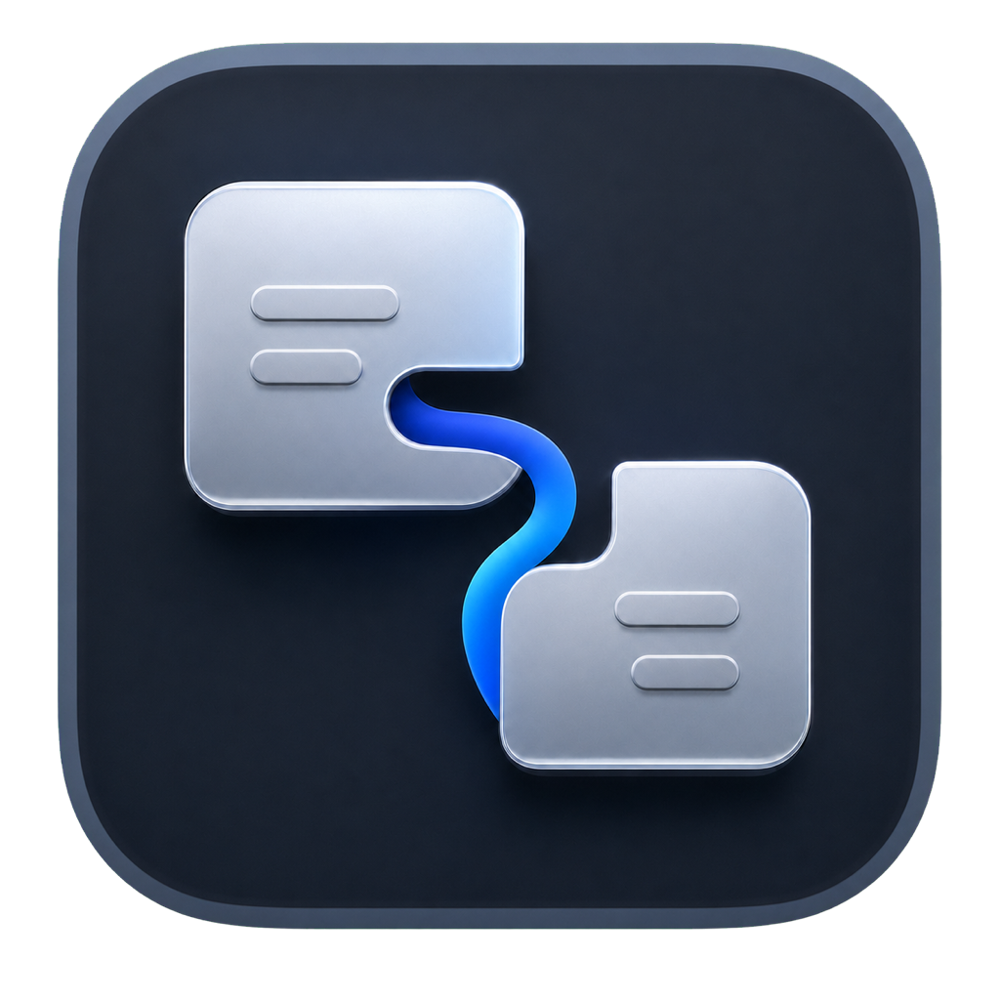
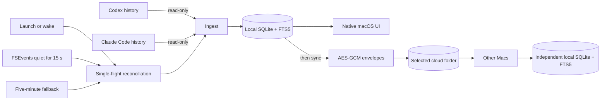

<p align="center">
  
</p>

<h1 align="center">Threadline</h1>

<p align="center">
  A private, native macOS library for Codex and Claude Code conversations.
</p>

<p align="center">
  Local-first · Read-only imports · Automatic reconciliation · Encrypted folder sync
</p>

<p align="center">
  <a href="https://github.com/ulissescomonian/threadline/releases/tag/v0.2.1"></a>
  
  
  
  <a href="https://github.com/ulissescomonian/threadline/releases/tag/v0.2.1"></a>
  <a href="https://github.com/ulissescomonian/threadline/actions/workflows/ci.yml"></a>
  <a href="LICENSE"></a>
</p>

<p align="center">
  <a href="https://github.com/ulissescomonian/threadline/releases/download/v0.2.1/Threadline-0.2.1-arm64.dmg"><strong>Download Threadline 0.2.1 for Apple Silicon (.dmg)</strong></a>
  <br>
  <a href="https://github.com/ulissescomonian/threadline/releases/tag/v0.2.1">Release notes and SHA-256 checksum</a>
</p>

> [!IMPORTANT]
> Threadline 0.2.1 (build 12) is a Preview. Keep the original Codex and Claude
> Code histories. The Apple Silicon DMG is not signed. It contains an app with
> a local code signature, not an Apple Developer ID signature; neither the app
> nor the DMG is notarized by Apple. Install it only from a source you trust,
> and never disable Gatekeeper to open it.

## What Threadline does

Codex and Claude Code keep useful conversation histories in different local
formats. Threadline reads those histories without modifying them, normalizes
them into one searchable SQLite library, and presents complete transcripts in a
native three-column macOS interface.

The library can remain local to one Mac or synchronize Threadline's own
encrypted representation through a user-selected folder managed by iCloud
Drive, OneDrive, or Google Drive. Threadline never moves the providers' history
folders or places its live SQLite database in cloud storage.

### Library and search

- Codex and Claude Code conversations in one chronological library
- provider, favorites, full-text search, and Needs Attention views
- native transcripts with messages, commands, tool calls, diffs, attachments,
  lifecycle events, projects, branches, and provider metadata
- SQLite and FTS5 with prefix-aware, diacritic-normalized search
- stable identities for primary sessions and provider subagents
- incremental source fingerprints and bounded concurrent parsing
- local notes, favorites, and deterministic conflict forks

### Encrypted multi-Mac sync

- explicit Local Only, iCloud Drive, OneDrive, and Google Drive choices
- create a new sync space or join one with its recovery key
- AES-GCM encryption before Threadline writes conversation data to the folder
- signed sync-space manifest and encrypted device profiles
- immutable, idempotent per-device segments and contiguous receive cursors
- bounded batches, partial-file protection, quarantine, and safe retry
- coordinated migration between storage providers
- any practical number of participating Macs; the design is not pair-specific

The cloud provider transports files and counts them against its normal storage
quota. Its Mac app remains responsible for uploading and downloading those
files. The provider can observe file names, sizes, timing, and activity even
though it cannot read Threadline's encrypted conversation payloads.

## Automatic reconciliation

Automatic reconciliation is owned by the main Threadline app. While the app is
running, it imports provider changes and then synchronizes the encrypted queue:

- immediately after application startup;
- when the Mac wakes from sleep;
- 15 seconds after the latest detected Codex or Claude Code filesystem change;
- through a fallback request every five minutes.

The filesystem trigger uses trailing debounce: another source event restarts
the 15-second quiet period. The scheduler is single-flight. Import and sync do
not overlap with another reconciliation, and requests received during an active
run are coalesced into one follow-up run. **Sync Now** requests the next sync as
soon as possible; it does not start a competing operation.

Automatic work is intentionally visually quiet. It does not show the manual
import or sync spinners, and it publishes the refreshed library, selection, and
detail together after durable work finishes. The visible conversation remains
stable while the background run is reading and synchronizing data.

Keep Threadline running in the menu bar for this behavior. Quitting the app
stops automatic reconciliation. **Start Threadline at login** opens the main app
in menu-bar mode after sign-in; the embedded `ThreadlineAgent` remains a
prototype and is not the coordinator for the current automatic loop.

## Status and diagnostics

Threadline separates connection health from queue state:

- **Sidebar** shows **Waiting to sync** whenever the queue has pending objects.
  It shows **Up to date** only when the connection is healthy and the queue is
  clear. Automatic failures appear as **Needs attention**.
- **Menu bar** exposes the same state, pending-item count, **Sync Now**,
  **Refresh Library**, settings, and the main window.
- **Health Center** shows indexed conversations, queued objects and bytes,
  last import, last completed sync, provider connections, and actionable
  diagnostics. A connected sync space does not imply an empty queue.
- Automatic failures remain visible without a modal alert. Threadline retains
  the safe local queue and retries automatically; **Sync Now** can request the
  next attempt sooner.

## Architecture



| Layer | Responsibility |
| --- | --- |
| `ProviderKit` | Discover and parse Codex and Claude Code sources read-only |
| `ConversationCore` | Models, SQLite/FTS5, crypto, folder transport, and devices |
| `ThreadlineRuntime` | Ingestion, automatic scheduling, synchronization, and health |
| `Threadline` | SwiftUI/AppKit app, menu bar, settings, and login-item control |
| `ThreadlineAgent` | Embedded prototype; not used for the current automatic loop |

Every Mac owns an independent local database. The selected sync folder contains
only versioned Threadline metadata and encrypted immutable records. Provider
source files stay in their normal locations and are never edited, moved, or
synchronized by Threadline.

## Requirements

- macOS 14 Sonoma or later
- Apple Silicon (`arm64`) for the distributed Preview DMG
- Codex, Claude Code, or both, with local history
- for multi-Mac sync, the selected cloud provider configured on every Mac
- Swift 6.1-capable Xcode or Command Line Tools only when building from source

The Preview DMG is not universal and does not run natively on Intel Macs.

## Install the Preview DMG

1. Download `Threadline-0.2.1-arm64.dmg` and
   `Threadline-0.2.1-arm64.dmg.sha256` from the same trusted GitHub Release.
2. Verify the download from its directory:

   ```bash
   shasum -a 256 -c Threadline-0.2.1-arm64.dmg.sha256
   ```

3. Open the DMG and drag **Threadline.app** to **Applications**.
4. Eject the DMG.
5. In Finder, open **Applications**, Control-click or right-click Threadline,
   choose **Open**, then confirm **Open**.

If macOS still blocks the first launch:

1. Try to open Threadline once so macOS records the decision.
2. Open **System Settings → Privacy & Security**.
3. In the Security section, choose **Open Anyway** for Threadline.
4. Authenticate with the Mac account if macOS asks, then confirm **Open**.

The exact wording varies by macOS version. Do not disable Gatekeeper globally,
do not run `spctl --master-disable`, and do not strip quarantine metadata as an
installation shortcut.

### What the Preview signature means

The Preview app has a local code signature so macOS can verify that its bundle
is internally consistent. It is not an Apple Developer ID signature, has no
Apple team identity, and is not notarized. The DMG is also not notarized and
does not have its own code signature. A local signer label may appear in
`codesign` output; that label is not an Apple trust assertion.

You can inspect the installed bundle without changing it:

```bash
codesign --verify --deep --strict /Applications/Threadline.app
codesign -dv --verbose=4 /Applications/Threadline.app
file /Applications/Threadline.app/Contents/MacOS/Threadline
```

Gatekeeper can still report the app as rejected because the local signature is
not notarized. Use Finder's **Open** or **Privacy & Security → Open Anyway** only
after verifying that the DMG came from the expected Preview source.

## Update a Preview installation

Threadline does not contain an automatic updater. To install another trusted
Preview build:

1. Quit Threadline from its menu-bar menu.
2. Open the new DMG.
3. Replace `/Applications/Threadline.app` with the new copy.
4. Launch it using the same Gatekeeper flow if macOS asks again.

Do not delete `~/Library/Application Support/Threadline` when replacing only the
application. That directory contains the local database and configuration.

Creating or joining a folder sync space stores its encryption key in the local
login Keychain. Because Preview builds use local signing rather than a stable
Apple Developer ID identity, macOS may ask again whether the updated app can
access an existing Threadline Keychain item. Such a prompt is expected only
after an update or a sync-configuration action you initiated. Authenticate with
the Mac login password only for a trusted build. Denying access leaves the local
library intact but can put synchronization in **Needs Attention**. Never paste
the Threadline recovery key into a macOS authentication prompt.

## Build from source

Clone and validate:

```bash
git clone https://github.com/ulissescomonian/threadline.git
cd threadline
swift build
swift test
swift build -c release
make app
```

`make app` runs `Scripts/package_app.sh`, builds a Release bundle, embeds the
icon and helper, checks executables for leaked workspace paths, signs the app,
and verifies the result. It uses ad-hoc signing unless `CODESIGN_IDENTITY` is
provided:

```bash
make app
CODESIGN_IDENTITY="Your Local Signing Identity" make app
codesign --verify --deep --strict .build/Threadline.app
open .build/Threadline.app
```

A local identity is still not an Apple Developer ID. Do not describe such an
artifact as notarized or Apple-trusted.

Useful commands:

```bash
make build       # Debug SwiftPM build
make test        # Complete test suite
make app         # Release application bundle
make run         # Package and open the local bundle
make clean       # Remove generated build artifacts
```

Package the already built, locally signed app inside the unsigned Preview DMG:

```bash
CODESIGN_IDENTITY="Your Local Signing Identity" make app
Scripts/package_dmg.sh
shasum -a 256 -c dist/Threadline-0.2.1-arm64.dmg.sha256
```

`Scripts/package_dmg.sh` verifies the app signature and executable architecture,
creates a compressed DMG with an Applications shortcut, verifies the image, and
writes:

- `dist/Threadline-0.2.1-arm64.dmg`
- `dist/Threadline-0.2.1-arm64.dmg.sha256`

The version and architecture come from the packaged app. `APP_PATH` and
`OUTPUT_DIR` can override the default `.build/Threadline.app` and `dist/`
locations. The ignored `dist/` directory is local output; publish the DMG and
its checksum together as assets of the same GitHub Release. The script packages
and verifies the app's existing signature. It does not sign the DMG, replace the
app signature with an Apple Developer ID signature, or notarize either artifact.

## Configure synchronization

### Create a sync space on the first Mac

1. Open **Settings → Sync**.
2. Choose iCloud Drive, OneDrive, or Google Drive.
3. Choose **Create New** and select a new, empty folder inside that provider's
   local macOS folder.
4. Save the recovery key in a password manager.
5. Keep Threadline open and wait for the provider to upload the folder before
   joining another Mac.

The provider choice is a label and a suggested location, not a hard-coded path.
Threadline records the exact folder authorized through the native picker.

### Join from another Mac

1. Install the same or a compatible Threadline build.
2. Wait until the provider has downloaded the existing sync folder locally.
3. Open **Settings → Sync**, choose the provider, and select **Join Existing**.
4. Select the existing Threadline folder and enter its recovery key.
5. Leave Threadline running while automatic reconciliation imports and syncs.

Participating computers appear in **Settings → Devices**, where they can be
renamed, refreshed, or cooperatively removed.

> [!CAUTION]
> The recovery key authorizes decryption of the synchronized library. It is not
> stored in the shared folder. Losing it can prevent another Mac from joining;
> exposing it can expose synchronized conversations. Store it separately in a
> password manager.

### Folder rules

- Create requires an empty folder.
- Join requires the existing folder and matching recovery key.
- Keep the folder downloaded and available locally while Threadline runs.
- Do not edit files inside the sync space.
- Do not select a provider history folder, repository, live database, or
  general-purpose folder containing unrelated files.

### Change providers

Provider changes use a coordinated copy:

1. Allow every Mac to finish synchronization, then quit Threadline everywhere
   except the Mac coordinating the move.
2. On that Mac, select the destination provider, choose **Move Library**, and
   select a new, empty folder.
3. Keep Threadline open until verification completes, then wait for the cloud
   client to upload the destination.
4. On every other Mac, choose **Follow Existing Move** and select that same
   downloaded destination.
5. Verify another Mac before manually removing the old provider folder.

Threadline preserves the sync-space identity and leaves the old folder intact.
It does not implement a distributed online migration barrier, so do not leave
another instance writing to the old location during the move.

Choosing **Local Only** stops remote synchronization after confirmation. It
does not delete the local library, provider histories, or remote folder.

## Sync and conflict semantics

Cloud-drive clients are eventually consistent. Files can arrive late, out of
order, or as temporary placeholders. Threadline advances each device cursor
only through contiguous validated sequences and never treats temporary or
partially downloaded files as committed data.

If the same logical conversation diverges on multiple Macs, Threadline keeps
both incompatible branches as deterministic conflict forks and surfaces them
in **Needs Attention**. It does not silently choose one transcript and discard
the other.

Removing a device is cooperative, not cryptographic erasure. A removed Mac
stops participating after it observes the registry update, but data or key
material already copied to it cannot be recalled.

## Privacy and security boundaries

- Provider histories are read-only inputs.
- The local SQLite database contains readable conversation text and relies on
  macOS account security; FileVault is recommended.
- Search indexes remain local to each Mac.
- Conversation payloads are encrypted before entering the sync folder.
- The active folder-sync key is stored locally in Keychain; the recovery key is
  shown to the user and is not written to the shared folder.
- The sync folder does not contain Threadline's live SQLite database.
- Security-scoped bookmarks retain access only to folders selected by the user.
- Provider and sync inputs are bounded and treated as untrusted.
- Invalid encrypted records are quarantined without blocking unrelated data.
- The app currently runs outside App Sandbox to discover provider histories and
  integrate with macOS login items.

See [SECURITY.md](SECURITY.md) for vulnerability reporting and supported
versions. Never attach a real database, transcript, sync folder, recovery key,
or diagnostic archive to a public issue.

## Provider ingestion

### Codex

Threadline prefers the Codex app-server interface and falls back to bounded
JSONL parsing. It reads active and archived sessions under the configured Codex
home, reconciles both representations, and prevents nested agent metadata from
replacing its parent session identity.

### Claude Code

Threadline reads project JSONL histories and keeps parent sessions and subagents
as distinct conversations. Hidden reasoning and signature objects are neither
shown nor retained in encrypted envelopes.

### Large or changing files

Reads, lines, messages, events, devices, files, and encrypted payloads have
explicit bounds. Large JSONL files use a bounded head/tail view with an omission
marker. A live writer's partial final line is retried during a later
reconciliation; the original file is never modified.

## Background and login behavior

Threadline can remain in the menu bar after the library window closes. The Dock
icon appears while the main window is open and remains available if the menu-bar
item is disabled.

**Start Threadline at login** uses macOS Service Management. macOS may require
approval in **System Settings → General → Login Items**. Local Preview signing
can make login-item eligibility less reliable than a Developer ID build. If the
setting is unavailable, launch Threadline manually and keep it running in the
menu bar.

## Local paths

| Purpose | Default location |
| --- | --- |
| Threadline application data | `~/Library/Application Support/Threadline` |
| Codex history root | `$CODEX_HOME`, otherwise `~/.codex` |
| Claude Code history root | `$CLAUDE_CONFIG_DIR`, otherwise `~/.claude` |

Tests can redirect application data with `THREADLINE_APP_SUPPORT`. Always use an
isolated temporary directory.

Important local artifacts include:

- `Threadline.sqlite`: local library and FTS index;
- `sync-configuration.json`: selected location and security-scoped bookmark;
- `device-id`: stable identity for this installation;
- `device-registry.json`: bounded local cache of participating devices.

## Testing

Run the complete local gates:

```bash
swift test
swift build -c release
make app
codesign --verify --deep --strict .build/Threadline.app
```

The suite combines XCTest and Swift Testing coverage for:

- Codex and Claude Code parsing, stable IDs, semantic fingerprints, and
  incremental import;
- SQLite migrations, FTS, conflicts, quarantine, and outbox batching;
- AES-GCM, Keychain scoping, bounded input validation, and manifest security;
- atomic folder publication, out-of-order delivery, partial files, and symlink
  rejection;
- recovery, transport switching, migration safety, failure semantics, and
  end-to-end folder sync;
- scheduler startup, periodic fallback, request coalescing, cancellation, and
  trailing debounce.

CI runs tests and packages a Release app on macOS with read-only repository
permissions. Release maintainers use `Scripts/package_dmg.sh` to produce the
DMG and checksum assets; the script does not notarize or publish them itself.

## Repository layout

```text
.
├── Package.swift
├── Makefile
├── Resources/                 # Info plists, entitlements, and icon source
├── Scripts/
│   ├── make_icon.sh           # Build Threadline.icns
│   ├── package_app.sh         # Build, sign, and verify Threadline.app
│   └── package_dmg.sh         # Verify and package DMG + SHA-256
├── Sources/
│   ├── ConversationCore/      # Models, SQLite, crypto, sync, devices
│   ├── ProviderKit/           # Codex and Claude Code adapters
│   ├── Threadline/            # Native app and menu-bar UI
│   ├── ThreadlineAgent/       # Embedded prototype
│   └── ThreadlineRuntime/     # Reconciliation, ingestion, sync, health
└── Tests/                     # Unit/integration tests and synthetic fixtures
```

## Troubleshooting

### The library is empty

Confirm that Codex or Claude Code has local history. For non-default locations,
set `CODEX_HOME` or `CLAUDE_CONFIG_DIR` before launching a source build. Choose
**Refresh Library** and inspect **Health Center**.

### Items are waiting to sync

Pending items are safely queued locally. Threadline will retry automatically
while it is running. Confirm that **Sync Space** is connected in Health Center
and that the provider has downloaded the selected folder. **Sync Now** requests
the next attempt as soon as possible.

### Automatic reconciliation needs attention

Open Health Center for the complete error. Fix folder availability, provider
access, recovery-key mismatch, or malformed input as indicated. Threadline
keeps the local library available and retries automatic work; it does not drop
the pending queue.

### The sync folder is unavailable

Confirm that the cloud client is running, the folder is downloaded, and its
volume is mounted. Open **Settings → Sync**, choose **Reconnect**, and select the
same sync space. Reconnection validates the manifest and key fingerprint.

### Another Mac rejects the recovery key

Select the existing folder, not a new empty folder, and enter the exact recovery
key created for that sync space. Do not copy local databases between Macs.

### Start at Login needs approval

Open **System Settings → General → Login Items**, approve Threadline if listed,
then refresh the setting. If the local signature is ineligible, launch the app
manually.

### Gatekeeper cannot verify Threadline

This is expected for the non-notarized Preview. Verify the source of the DMG,
then use Finder's **Open** or **Privacy & Security → Open Anyway**. Never disable
Gatekeeper globally.

### Keychain asks after an update

Confirm that you initiated the update and trust the replacement app. The prompt
uses the Mac login password; it does not ask for the Threadline recovery key.
Deny access if the prompt is unexpected, then inspect the installed app source
and signature before trying again.

## Current Preview limitations

- The distributed DMG is Apple Silicon-only, unsigned, and not notarized. Its
  app is locally signed rather than Apple Developer ID-signed and is also not
  notarized.
- There is no automatic updater.
- Automatic reconciliation requires the main app to remain running; the helper
  does not continue synchronization after an explicit quit.
- Start at Login can require approval or be unavailable for a local signature.
- Recovery-key rotation and strong cryptographic device revocation are not
  implemented.
- Sync-space compaction is not automatic, so immutable history can grow beyond
  the latest local snapshot.
- Provider migration is coordinated, not a distributed online barrier.
- Multiple Threadline processes must not share one local database.
- Local readable data relies on macOS account security and FileVault.
- Cloud availability, placeholders, quota, and upload/download latency remain
  controlled by the selected provider.

## Contributing

Read [CONTRIBUTING.md](CONTRIBUTING.md) before submitting changes. Preserve
provider histories as read-only inputs, keep fixtures synthetic, add regression
tests for persisted or synchronized contracts, and inspect diffs and binaries
for private paths or data.

## License

Threadline is available under the [MIT License](LICENSE).
